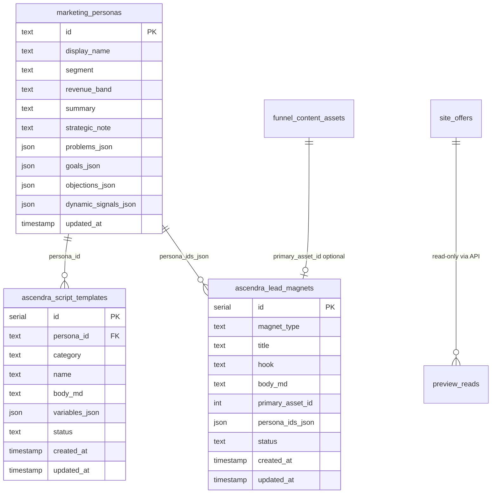

# Ascendra Offer + Persona Intelligence Center — Architecture (Phase 1)

**Companion:** [`ascendra-offer-system-audit.md`](./ascendra-offer-system-audit.md) (Phase 0 audit)  
**Status:** Phase 1 — API contracts, ER model, permissions, prompt policy (this doc). **Phase 2 MVP code** is implemented in-repo (`shared/ascendraIntelligenceSchema.ts`, `app/api/admin/ascendra-intelligence/*`, `app/admin/ascendra-intelligence/*`).  
**Last updated:** 2026-03-21  

---

## 1. Scope of this document

This file defines **contracts and structure** for the internal admin system. **Phase 2 MVP** implements (in code):

- Canonical **`marketing_personas`** (six core + Denishia) with admin edit
- **`ascendra_script_templates`** CRUD (persona-scoped)
- **`ascendra_lead_magnets`** table (minimal rows; optional `primary_asset_id` to `funnel_content_assets`)
- Admin **hub**, **persona detail**, **scripts**, **preview** (read-only offer snapshot + DM/email framing)
- **Admin-only** JSON routes under `/api/admin/ascendra-intelligence/*`

Deferred to later phases: Value Grader orchestrator UI, knowledge modules, CSV research import UI, LLM insight generation endpoints.

---

## 2. Entity relationship (logical)



`site_offers` and `funnel_content_assets` remain in `shared/schema.ts`; **no FK** from `ascendra_lead_magnets.primary_asset_id` in Drizzle (avoid circular schema imports); integrity is **application-level**.

---

## 3. API contracts

Base path: **`/api/admin/ascendra-intelligence`**

All routes:

- **Method:** as listed
- **Auth:** session cookie; **`isAdmin(req)`** (approved admin). Otherwise **403**.
- **Content-Type:** `application/json` where body is used

### 3.1 Personas

| Method | Path | Body | Response |
|--------|------|------|----------|
| `GET` | `/personas` | — | `{ personas: MarketingPersona[] }` |
| `GET` | `/personas/[id]` | — | `{ persona: MarketingPersona }` or **404** |
| `PATCH` | `/personas/[id]` | Partial persona fields (see below) | `{ persona: MarketingPersona }` |

**`MarketingPersona` (JSON shape)**

```typescript
type MarketingPersona = {
  id: string;
  displayName: string;
  segment: string | null;
  revenueBand: string | null;
  summary: string | null;
  strategicNote: string | null;
  problems: string[];
  goals: string[];
  objections: string[];
  dynamicSignals: string[];
  updatedAt: string; // ISO
};
```

**`PATCH` allowed keys:** `displayName`, `segment`, `revenueBand`, `summary`, `strategicNote`, `problems`, `goals`, `objections`, `dynamicSignals` (arrays replace stored JSON arrays).

**`id`** is immutable (slug: `marcus`, `kristopher`, `tasha`, `devon`, `andre`, `denishia`).

### 3.2 Script templates

| Method | Path | Body | Response |
|--------|------|------|----------|
| `GET` | `/scripts` | Query: `?personaId=` optional | `{ scripts: ScriptTemplate[] }` |
| `POST` | `/scripts` | Create body | `{ script: ScriptTemplate }` |
| `GET` | `/scripts/[id]` | — | `{ script: ScriptTemplate }` or **404** |
| `PATCH` | `/scripts/[id]` | Partial | `{ script: ScriptTemplate }` |
| `DELETE` | `/scripts/[id]` | — | `{ ok: true }` |

**`ScriptTemplate`**

```typescript
type ScriptTemplate = {
  id: number;
  personaId: string;
  category: "warm" | "cold" | "content" | "follow_up" | "objection";
  name: string;
  bodyMd: string;
  variables: string[];
  status: "draft" | "approved" | "published";
  createdAt: string;
  updatedAt: string;
};
```

**`POST /scripts` body:** `personaId`, `category`, `name`, optional `bodyMd`, optional `variables`, optional `status`.

### 3.3 Lead magnets (MVP CRUD)

| Method | Path | Response |
|--------|------|----------|
| `GET` | `/lead-magnets` | `{ magnets: LeadMagnet[] }` |
| `POST` | `/lead-magnets` | `{ magnet: LeadMagnet }` |
| `GET` | `/lead-magnets/[id]` | single |
| `PATCH` | `/lead-magnets/[id]` | single |
| `DELETE` | `/lead-magnets/[id]` | `{ ok: true }` |

**`LeadMagnet.magnetType`:** `reveal_problems` | `sample_trial` | `one_step_system`

### 3.4 Preview (internal)

| Method | Path | Body | Response |
|--------|------|------|----------|
| `POST` | `/preview` | Discriminated union | Preview payload (no persistence) |

**Body variants**

```typescript
type PreviewRequest =
  | { mode: "landing"; offerSlug: string }
  | { mode: "dm"; text: string; personaDisplayName?: string }
  | { mode: "email"; html: string; subject?: string };
```

**Responses (examples)**

- `landing`: `{ mode, offerSlug, name, heroTitle?, heroSubtitle?, ctaButton?, ctaHref?, bullets?: string[] }` derived from `site_offers.sections` + meta.
- `dm`: `{ mode, plainText, charCount }` (normalized whitespace)
- `email`: `{ mode, subject, htmlSanitizedNote, previewTextPlain }` — **no** full HTML sanitization library required for MVP; strip script tags only and return truncated plain-text preview for admin eyes only.

---

## 4. Navigation & UI map (MVP)

| Route | Purpose |
|-------|---------|
| `/admin/ascendra-intelligence` | Hub: links, counts, deep links to offers/funnel assets |
| `/admin/ascendra-intelligence/personas` | List personas |
| `/admin/ascendra-intelligence/personas/[id]` | View/edit profile fields |
| `/admin/ascendra-intelligence/scripts` | List/filter scripts; link to edit |
| `/admin/ascendra-intelligence/scripts/new` | Create script |
| `/admin/ascendra-intelligence/scripts/[id]` | Edit script |
| `/admin/ascendra-intelligence/preview` | Preview tool (landing / DM / email) |
| `/admin/ascendra-intelligence/lead-magnets` | Optional list page (minimal) |

**Header:** Entry **“Offer + Persona IQ”** (or similar) visible to **all approved admins** (same visibility rule as Website Analytics — no extra `permissions` key).

---

## 5. Permissions matrix

| Actor | Personas | Scripts | Magnets | Preview |
|-------|----------|---------|---------|---------|
| Approved admin | R/W | R/W | R/W | R/W |
| Non-admin / unauthenticated | — | — | — | — |
| Super user | same | same | same | same |

No new `permissions` column flags for MVP.

---

## 6. AI / prompt policy (forward-looking)

Not implemented in MVP routes; when added:

- **Inputs:** `personaId`, `task` (e.g. `messaging_suggestion`, `script_rewrite`), `context` (markdown), `model` (env default).
- **Outputs:** stored as draft rows or CMS docs; **never** auto-publish.
- **Metadata:** `model`, `promptVersion`, `createdAt`, optional `confidenceLabel`.
- **Compliance:** No automated scraping; research citations must reference internal batches/uploads only.

---

## 7. Security notes

- Preview endpoint is **admin-only**; it may echo offer content — acceptable for internal use.
- Do **not** expose these routes under `/api` without `admin` prefix.
- Rate limiting: inherits global **admin** middleware (Upstash) when configured.

---

## 8. File layout (Phase 2 — present in repo)

```
shared/ascendraIntelligenceSchema.ts
shared/ascendraPersonaSeed.ts
server/services/ascendraIntelligenceService.ts
server/seed.ts                          # calls seedMarketingPersonas()
app/api/admin/ascendra-intelligence/personas/route.ts
app/api/admin/ascendra-intelligence/personas/[id]/route.ts
app/api/admin/ascendra-intelligence/scripts/route.ts
app/api/admin/ascendra-intelligence/scripts/[id]/route.ts
app/api/admin/ascendra-intelligence/lead-magnets/route.ts
app/api/admin/ascendra-intelligence/lead-magnets/[id]/route.ts
app/api/admin/ascendra-intelligence/preview/route.ts
app/api/admin/ascendra-intelligence/summary/route.ts
app/admin/ascendra-intelligence/**
app/components/Header.tsx               # nav: Offer + Persona IQ
```

**Database:** run `npm run db:push` then `npm run db:seed` to create tables and upsert the six personas + Denishia.

---

*End of Phase 1 architecture addendum.*
