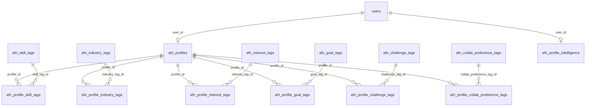

# Ascendra Founder Network (AFN) — Audit & Integration Plan

## PHASE A — Current Project Audit

### 1. Existing App Structure

- **App Router**: Next.js 16 App Router; routes under `app/` with `page.tsx`, `layout.tsx`.
- **Route groups**: No explicit groups; flat structure with `admin/`, `auth/`, `login/`, `dashboard/`, `blog/`, `assessment/`, `offers/`, etc.
- **Layouts**: Root `app/layout.tsx` (Providers, FixedHeaderWrapper, ScrollProgress, SiteFooter); `app/auth/layout.tsx`; `app/login/layout.tsx`; `app/admin/layout.tsx` (AdminGlobalTips); `app/data-deletion-request/layout.tsx`.
- **Auth setup**: Session-based auth via **Passport** (local, GitHub, Google). Session store: **connect-pg-simple** (PostgreSQL). Session ID in cookies (`sessionId` or `connect.sid`). `getSessionUser(req)` in `app/lib/auth-helpers.ts` reads session from storage; `isAdmin(req)`, `isSuperUser(req)`, `hasPermission(req, permission)`.
- **Database**: **Drizzle ORM** + **PostgreSQL** (@neondatabase/serverless for runtime; `pg` for migrations/drizzle-kit push). No Prisma, no Supabase.
- **Route handlers / APIs**: Under `app/api/` (e.g. `/api/user`, `/api/login`, `/api/register`, `/api/logout`, `/api/admin/*`, `/api/assessment/*`). Pattern: `export async function GET/POST(req)`, `getSessionUser(req)`, `storage.*`.
- **Admin**: `app/admin/*` (dashboard, crm, blog, invoices, newsletters, offers, reminders, users, system, etc.); protected by `isAdmin(req)`; layout wraps with AdminGlobalTips.
- **Shared components**: `app/components/` — `ui/` (shadcn-style: button, card, form, input, dialog, tabs, etc.), `admin/`, `blog/`, `assessment/`, `funnel/`, `motion/`, etc.
- **Design system**: Tailwind CSS; design tokens via Tailwind theme; `components/ui/` primitives (Radix-based).
- **Utility libs**: `app/lib/` — `queryClient.ts` (apiRequest, queryClient), `auth-helpers.ts`, `siteUrl.ts`, `company.ts`, `view-mode-context.ts`, etc.
- **Form patterns**: react-hook-form + zod + `@hookform/resolvers` + `Form`, `FormField`, `FormItem`, `FormLabel`, `FormControl`, `FormMessage` from `components/ui/form`.
- **Table/card/list**: `components/ui/card`, `components/ui/table`; list UIs built with Card + map.
- **Nav/sidebar**: `Header.tsx` (main site nav + dropdowns); admin has sidebar/nav in layout and per-page back links.
- **State**: TanStack Query (server state); React state; ViewModeProvider; AuthProvider (useAuth).
- **Animation**: framer-motion used in components (e.g. motion/, AnimatedCard, SpotlightCard).

### 2. Technical Stack in Practice

| Component        | Present | Notes |
|-----------------|--------|--------|
| Next.js App Router | Yes | 16.x |
| TypeScript       | Yes | Strict |
| Tailwind         | Yes | v3 |
| shadcn/Radix     | Yes | Button, Card, Dialog, Tabs, Select, etc. |
| Supabase         | No | Not used |
| Prisma           | No | Not used |
| Drizzle ORM      | Yes | shared/schema.ts, crmSchema, newsletterSchema, blogAnalyticsSchema |
| Zod              | Yes | Validation, createInsertSchema (drizzle-zod) |
| TanStack Query   | Yes | useQuery, useMutation, queryClient, apiRequest |
| Zustand          | No | Not in package.json |
| Framer Motion    | Yes | Used in motion/ and elsewhere |
| react-hook-form  | Yes | Forms + zodResolver |
| Express/session  | Yes | Passport + connect-pg-simple (session store only; API routes are Next.js) |

### 3. Architecture Constraints

- **Where AFN should live**: New route tree under `app/community/` (or `app/afn/`). Prefer `/community` for clarity. All AFN-specific schema in a dedicated module (e.g. `shared/afnSchema.ts`) and exported from `shared/schema.ts` so Drizzle push includes it.
- **Auth extension**: Reuse existing `users` table. Add optional **AFN profile** linked by `user_id` (1:1). No separate “AFN user” — same login/register; after register, redirect to community onboarding when entering AFN.
- **Role logic**: Existing roles: `user`, `developer`, admin via `isAdmin` + `adminApproved`. AFN members are standard users with a profile; no new role required for “member.” Admin can later get moderation views.
- **Admin extension**: Add admin section for moderation (reports, flags) and optionally “AFN members” list; can be a sub-area under existing admin or `/admin/community`.
- **New schema**: Add all AFN tables in `shared/afnSchema.ts` (profiles, profile_settings, member_tags, discussion_categories, discussion_posts, comments, reactions, saved_posts, collaboration_posts, message_threads, messages, resources, lead_signals, notifications, moderation_reports). Reference `users.id` for user_id.
- **Messaging/realtime**: No Supabase/WebSocket in project. Private messaging will be request/response (polling or load-on-open). No realtime presence; acceptable for v1.
- **Risks**: (1) Large schema addition — do in one Drizzle file and one db:push. (2) Username uniqueness: `users.username` exists; AFN profile can add `username` for public URL (e.g. /community/members/[username]) — ensure uniqueness among AFN profiles or reuse users.username. (3) Existing register flow: add post-register redirect to /community/onboarding when destination is community.

### 4. Reusable UI Opportunities

- **Dashboard shell**: Reuse Card, Tabs, layout patterns from `app/dashboard/page.tsx` and `app/admin/dashboard/page.tsx` for community shell (sidebar + main content).
- **Profile forms**: Reuse Form, Input, Label, Textarea, Select, Button from `components/ui`; same validation pattern (zod + react-hook-form).
- **Onboarding**: Multi-step like assessment wizard or admin flows; use Card, Button, Stepper (or custom steps), progress.
- **Cards**: `components/ui/card` for post cards, member cards, resource cards.
- **Tabs**: `components/ui/tabs` for Feed / Collab / Members / Resources.
- **Drawers/Modals**: `components/ui/dialog`, `components/ui/sheet` for compose, settings, confirmations.
- **Filters**: Select + Button or custom filter bar (existing pattern in admin CRM).
- **Lists**: Map + Card; empty state with text + CTA.
- **Settings panels**: Card + Form sections; reuse from admin or dashboard.
- **Empty / loading**: Use Loader2 spinner; empty state copy + primary CTA.
- **Avatar**: `components/ui/avatar` for member avatars.

---

## 2. AFN Integration Plan

### Recommended Route Map

| Route | Purpose |
|-------|--------|
| `/community` | AFN landing (public): hero, value prop, CTA join/sign in |
| `/community/join` | Sign up / register (or redirect to /auth?redirect=/community/onboarding) |
| `/community/onboarding` | Multi-step onboarding (gated; post-login) |
| `/community/feed` | Main discussion feed (auth required) |
| `/community/category/[slug]` | Category filter feed |
| `/community/post/[id]` | Single post + comments |
| `/community/collab` | Collaboration board |
| `/community/members` | Member directory (auth, respect visibility) |
| `/community/members/[username]` | Public member profile (respect visibility) |
| `/community/resources` | Premium resources |
| `/community/inbox` | Private messaging (auth, permission checks) |
| `/community/profile` | Own profile edit (auth) |
| `/community/settings` | Profile settings / privacy (auth) |

### Folder Structure Plan

- **Routes**: `app/community/page.tsx` (landing), `app/community/feed/page.tsx`, `app/community/category/[slug]/page.tsx`, `app/community/post/[id]/page.tsx`, `app/community/collab/page.tsx`, `app/community/members/page.tsx`, `app/community/members/[username]/page.tsx`, `app/community/resources/page.tsx`, `app/community/inbox/page.tsx`, `app/community/profile/page.tsx`, `app/community/settings/page.tsx`, `app/community/onboarding/page.tsx`.
- **Layout**: `app/community/layout.tsx` (optional shell for authenticated sub-routes); landing can be full-width; feed/collab/members/resources/inbox/profile/settings share a **CommunityShell** (sidebar + content).
- **API**: `app/api/community/` — e.g. `profile/route.ts`, `profile/settings/route.ts`, `posts/route.ts`, `posts/[id]/route.ts`, `categories/route.ts`, `comments/route.ts`, `collab/route.ts`, `members/route.ts`, `messages/route.ts`, `resources/route.ts`, `onboarding/route.ts`, `lead-signals/route.ts`, `report/route.ts`, `notifications/route.ts`.
- **Schema**: `shared/afnSchema.ts` — all AFN tables; export from `shared/schema.ts`.
- **Storage**: Extend `server/storage.ts` with AFN methods, or add `server/afnStorage.ts` that uses `db` and is called from API routes.
- **Components**: `app/components/community/` — shell, onboarding steps, post cards, comment thread, member cards, collab cards, inbox, resource cards, conversion CTAs.
- **Lib**: `app/lib/community/` or `app/lib/afn/` — constants (categories, message permission enums), permission helpers (canMessage, canViewProfile).

### Data Architecture Plan

- **User linkage**: AFN profiles reference `users.id` (user_id). One profile per user.
- **profiles**: id, user_id, full_name, display_name, username (unique), avatar_url, headline, bio, business_name, business_stage, industry, location, website_url, linkedin_url, other_social_url, what_building, biggest_challenge, goals, looking_for, collaboration_interests, ask_me_about, featured_resource_url, profile_completion_score, is_onboarding_complete, created_at, updated_at.
- **profile_settings**: id, user_id, profile_visibility (public | private), message_permission (none | collab_only | allow), open_to_collaborate, show_activity, show_contact_links, email_notifications_enabled, in_app_notifications_enabled, created_at, updated_at.
- **member_tags**, **profile_member_tags**: Tags for filtering (e.g. founder, freelancer, developer).
- **discussion_categories**: id, slug, name, description, sort_order, is_active.
- **discussion_posts**: id, author_id (user_id), category_id, title, slug, body, excerpt, status (draft | published | archived), is_featured, helpful_count, comment_count, view_count, created_at, updated_at.
- **discussion_post_tags**, **discussion_comments**, **discussion_reactions**, **saved_posts**: As specified in requirements.
- **collaboration_posts**: id, author_id, type, title, description, status (open | closed), contact_preference, external_contact_url, budget_range, timeline, industry, tags (json), created_at, updated_at.
- **message_threads**, **message_thread_participants**, **messages**: For 1:1 private messaging.
- **resources**, **user_resource_views**: Premium resources and view tracking.
- **lead_signals**: user_id, signal_type, signal_value, source, metadata, created_at.
- **notifications**: user_id, type, title, body, entity_type, entity_id, is_read, created_at.
- **moderation_reports**: reporter_id, target_type, target_id, reason, details, status, created_at, updated_at.

### Feature Implementation Order

1. **Milestone 1 (Foundation)**: Schema (afnSchema.ts), db push, storage methods, auth gate (require user for protected routes), profile + profile_settings CRUD, onboarding flow, community shell layout and nav.
2. **Milestone 2 (Landing + Feed)**: Community landing page, feed API + page, categories, post create/detail, comments, reactions, saved posts.
3. **Milestone 3 (Members + Resources)**: Member directory API + page, public profile page (visibility), resources API + page, resource views.
4. **Milestone 4 (Collab + Messaging)**: Collaboration board (CRUD, filters), private messaging (threads, permission checks), inbox UI.
5. **Milestone 5 (Signals + Moderation + Polish)**: Lead signal recording, moderation reports, notifications foundation, conversion surfaces, seed data, polish.

### Component Inventory (Planned)

- **Landing**: AFNHero, AFNBenefitsGrid, AFNPreviewDiscussionList, AFNPreviewMemberGrid, AFNJoinCTA.
- **Shell**: CommunityShell, CommunitySidebar, CommunityTopbar, MobileCommunityNav.
- **Onboarding**: OnboardingStepper, FounderTypeStep, BusinessStageStep, ChallengeGoalsStep, CollaborationPrivacyStep, OnboardingCompleteCard.
- **Profile**: FounderProfileCard, FounderProfileHeader, FounderProfileDetails, FounderProfileEditor, ProfileVisibilityBadge, CollabOpenBadge.
- **Discussion**: DiscussionComposer, DiscussionPostCard, DiscussionFilterBar, DiscussionCategoryTabs, SavePostButton, HelpfulReactionButton, DiscussionDetailHeader, CommentThread, CommentComposer.
- **Members**: MemberDirectoryFilters, MemberDirectoryGrid, FeaturedMemberCard.
- **Collab**: CollabPostCard, CollabComposer, CollabFilterBar, CollabStatusBadge.
- **Inbox**: InboxSidebar, ConversationView, MessageComposer, MessagePermissionGate.
- **Resources**: ResourceCard, FeaturedResourceBanner.
- **Conversion**: ContextualHelpCTA, FounderNextStepCard.

### Security and Permissions Plan

- **Protected routes**: Middleware or server component that calls `getSessionUser()`; redirect to `/login?redirect=/community/...` if null. Apply to feed, post create, comments, collab, members (list), inbox, profile, settings, onboarding.
- **Public**: Landing `/community`, and optionally public member profile view when profile_visibility = public (limited fields).
- **Profile visibility**: Server-side: when returning member list or profile by username, filter or mask fields by profile_settings.profile_visibility and profile_settings.show_contact_links.
- **Message permission**: Before creating a thread or message, server checks: target user’s profile_settings.message_permission and open_to_collaborate; allow only if (message_permission = allow) or (message_permission = collab_only and open_to_collaborate = true). Reject otherwise.
- **Owner-only edit/delete**: For posts, comments, collab posts — check author_id === current user id.
- **Moderation**: Reports stored; admin-only endpoint to list reports and update status (future). No delete-by-reporter.
- **Validation**: Zod schemas for all API bodies; sanitize inputs; use parameterized queries (Drizzle).

### Lead Intelligence Plan

- **Capture**: On onboarding submit — record lead_signals for business_stage, industry, biggest_challenge, goals, open_to_collaborate, tags (SERVICE_INTENT, WEBSITE_HELP_INTEREST, etc. as appropriate). On discussion post/comment — optional DISCUSSION_INTENT_SIGNAL. On resource view — RESOURCE_INTEREST. On collab post — OPEN_TO_COLLAB or type-based signal. On high engagement (e.g. multiple posts/comments) — HIGH_ENGAGEMENT_FOUNDER.
- **Storage**: lead_signals table (user_id, signal_type, signal_value, source, metadata, created_at). No CRM sync in v1; structure ready for future scoring and sync.

---

## 3. Implementation Roadmap

- **Phase B** ✅: Schema + storage, auth integration, profile + profile_settings, onboarding, community shell.
- **Phase C** ✅: Landing, feed, categories, posts, comments, members, public profile, resources.
- **Phase D** ✅: Collab board, private messaging (with permission logic), lead signals, moderation reports, notifications foundation, conversion surfaces.
- **Phase E** ✅: Seed demo content, polish, responsive pass, final summary.

---

## PHASE B — Implementation Report (Foundation)

### Files added

- **shared/afnSchema.ts** — All AFN tables: afn_profiles, afn_profile_settings, afn_member_tags, afn_profile_member_tags, afn_discussion_categories, afn_discussion_posts, afn_discussion_post_tags, afn_discussion_comments, afn_discussion_reactions, afn_saved_posts, afn_collaboration_posts, afn_message_threads, afn_message_thread_participants, afn_messages, afn_resources, afn_user_resource_views, afn_lead_signals, afn_notifications, afn_moderation_reports.
- **shared/schema.ts** — Re-export of afnSchema.
- **server/afnStorage.ts** — AFN data access: profiles, settings, categories, posts, comments, reactions, saved posts, collab posts, message threads/messages, resources, lead signals, notifications, moderation. Includes `canMessageTarget()` for server-side message permission check.
- **app/lib/community/constants.ts** — PROFILE_VISIBILITY, MESSAGE_PERMISSION, DISCUSSION_CATEGORIES, COLLAB_TYPES, BUSINESS_STAGES, FOUNDER_TYPES.
- **app/community/layout.tsx** — Community layout with metadata.
- **app/community/page.tsx** — AFN landing: hero, value grid, who it’s for, CTA (Join / Sign in or Go to feed when logged in).
- **app/community/onboarding/page.tsx** — Multi-step onboarding (founder type, stage & industry, what you’re building, collaboration & privacy), POST to /api/community/onboarding, lead signals recorded.
- **app/community/feed/page.tsx** — Feed page with CommunityShell; placeholder “No posts yet”.
- **app/community/profile/page.tsx** — Own profile edit form (GET/PATCH /api/community/profile).
- **app/community/settings/page.tsx** — Privacy & messaging settings (GET/PATCH /api/community/profile/settings).
- **app/community/collab/page.tsx**, **members/page.tsx**, **resources/page.tsx**, **inbox/page.tsx** — Placeholder pages with shell.
- **app/components/community/CommunityShell.tsx** — Shell with nav (Feed, Collaboration, Members, Resources, Inbox, Profile, Settings), responsive with sheet on mobile.
- **app/api/community/profile/route.ts** — GET/PATCH current user’s AFN profile.
- **app/api/community/profile/settings/route.ts** — GET/PATCH profile settings.
- **app/api/community/onboarding/route.ts** — POST onboarding (upsert profile + settings, set isOnboardingComplete, record lead signals).
- **server/seed.ts** — seedAfnDiscussionCategories() for 6 categories; called from seedDatabase().
- **app/components/Header.tsx** — “Community” added to primary nav.

### What is working

- DB: All AFN tables created via `npm run db:push`.
- Landing: `/community` shows premium hero, value grid, and CTAs; logged-in users see “Go to feed” / “Your profile”.
- Auth: Protected routes redirect to login with redirect back; onboarding redirects unauthenticated users to `/auth?redirect=/community/onboarding`.
- Onboarding: 4-step flow then “You’re in”; POST creates/updates profile and settings and records lead signals (BUSINESS_STAGE_SIGNAL, BIGGEST_CHALLENGE, OPEN_TO_COLLAB, SERVICE_INTENT).
- Profile: Load and update own profile via form; profile API uses current user id.
- Settings: Load and update visibility, message permission, open to collaborate, show activity, show contact links.
- Shell: Feed, Collab, Members, Resources, Inbox, Profile, Settings share CommunityShell with responsive nav.
- Seed: `npm run db:seed` seeds AFN discussion categories (run after db:push).

---

## PHASE C — Implementation Report (Discussion, Members, Resources)

### Implemented

- **Discussion**: Create post (dialog), list by category (tabs + query), post detail at `/community/post/[id]`, comments (list + composer), helpful reaction, save post, view count increment. Comment creation notifies post author (in-app) when author ≠ commenter.
- **Members**: Directory at `/community/members` with filters (industry, businessStage); public profile at `/community/members/[username]` (bio, what building, challenge, collaboration, links if `showContactLinks`), “Message” CTA → `/community/inbox?with=userId`.
- **Resources**: List at `/community/resources` (featured + rest), detail at `/community/resources/[slug]` with view tracking (POST view on load).

### APIs added (Phase C)

- `GET/POST /api/community/categories` — list/create categories.
- `GET/POST /api/community/posts` — list (with author, savedPostIds), create (categoryId, title, body).
- `GET/PATCH/DELETE /api/community/posts/[id]` — get (increments view), author-only update/delete.
- `POST /api/community/posts/[id]/view`, `GET/POST .../comments`, `POST .../reaction`, `POST .../saved`.
- `GET /api/community/members` (query: industry, businessStage), `GET /api/community/members/[username]` (public profile).
- `GET /api/community/resources`, `GET /api/community/resources/[slug]`, `POST /api/community/resources/[slug]/view`.

---

## PHASE D — Implementation Report (Collab, Messaging, Report, Notifications)

### Implemented

- **Collaboration board**: List (open/closed), create dialog (type, title, description), “Message” → inbox with `?with=authorId`. `GET/POST /api/community/collab`, `GET/PATCH/DELETE /api/community/collab/[id]` (author-only PATCH/DELETE).
- **Private messaging**: Threads list; create/open thread via POST with `otherUserId` (server checks `canMessageTarget`). `GET /api/community/messages/threads`, `POST .../threads`, `GET .../threads/[id]`, `POST .../threads/[id]/messages`. Inbox UI at `/community/inbox`; `?with=userId` creates/opens thread and invalidates threads list.
- **Reporting**: `POST /api/community/report` (targetType, targetId, reason, details).
- **Notifications**: Comment creation creates in-app notification for post author. `GET/PATCH /api/community/notifications` (list; PATCH mark read by id/ids/markAll, scoped to current user).

### Conversion surfaces

- **Message** on public profile (`/community/members/[username]`) and on collab post cards → `/community/inbox?with=userId`.
- Shell nav: Feed, Collaboration, Members, Resources, Inbox, Profile, Settings. Landing CTAs: Join / Sign in, or “Go to feed” when logged in.

---

## PHASE E — Implementation Report (Seed, Polish, Launch)

### Seed demo content

- **Script**: `npm run db:seed-afn` runs `scripts/seed-afn-demo.ts`.
- **Requires**: At least one user and AFN profile (complete community onboarding), and discussion categories (`npm run db:seed`).
- **Seeds**: 2 discussion posts (with 1 comment on the first), 2 collaboration posts (looking_for_partner, offering_services), 2 resources (featured + standard). All authored by the first user in the DB.

### Polish and responsive

- Community pages use responsive layout: container, flex-wrap for filters/cards, `CommunityShell` with sheet nav on small screens (`lg:hidden`), inbox `md:grid-cols-[240px_1fr]` (stacked on mobile). Touch targets use standard Button/Card padding.

### Launch notes

- **Auth**: Protected community routes redirect to `/login?redirect=...`. Onboarding at `/community/onboarding` creates profile and settings and records lead signals.
- **Message permission**: Server enforces `canMessageTarget(targetSettings)` before creating threads or sending; inbox and profile “Message” respect this.
- **Type check**: Use `npm run check` (tsc); `npm run lint` is not used per project notes.

---

*Document generated as part of AFN implementation. Phases B through E are complete.*

---

## Current implementation snapshot (2026-03)

**Purpose:** Single source of truth for product and engineering: what ships today in AFN, which APIs exist, and how Phase 1–12 foundations map to code.

### Tables (`shared/afnSchema.ts`)

| Table / entity | Role |
|----------------|------|
| `afn_profiles` | 1:1 with `users.id`; legacy text fields **plus** Phase 1 columns: `primary_role`, `secondary_role`, `communication_style`, `content_preference`, `timezone`, `availability_json`, `event_preferences_json`, `mentorship_interest`, `project_interest`, `tribe_preference`, `personality_traits_json`, `invite_likelihood_score`, `engagement_stage`, `community_maturity_level`, `timeline_live_access_level` |
| `afn_profile_settings` | Visibility, messaging, notification prefs (unchanged) |
| `afn_member_tags` / `afn_profile_member_tags` | Legacy broad member labels |
| `afn_skill_tags` / `afn_profile_skill_tags` | Normalized skills → `afn_profiles.id` |
| `afn_industry_tags` / `afn_profile_industry_tags` | Normalized industries |
| `afn_interest_tags` / `afn_profile_interest_tags` | Interests |
| `afn_goal_tags` / `afn_profile_goal_tags` | Goals |
| `afn_challenge_tags` / `afn_profile_challenge_tags` | Challenges |
| `afn_collab_preference_tags` / `afn_profile_collab_preference_tags` | Collaboration preferences |
| `afn_profile_intelligence` | Phase 2 cached scores (one row per `user_id`) |
| `afn_invites` | Phase 7 invite log (`inviter_user_id`, `invitee_email`, `status`, `source_moment`) |
| `afn_scoring_config` | Phase 12 tunable `weights_json` (admin) |
| `afn_live_sessions` / `afn_live_provider_logs` | Phase 9 — provisioned rooms + provider failover audit |
| `afn_timeline_live_overrides` | Phase 10 — admin Timeline Live tier override |
| *(existing)* discussions, collab, messages, resources, connections, lead_signals, notifications, moderation | Unchanged |

### ERD — profile extensions & tag normalization

All normalized tag junctions reference **`afn_profiles.id`** (`profile_id`), not `users.id`, so one graph row anchors taxonomy links. `users.id` remains the auth key on `afn_profiles.user_id` only.

**Rule:** No second “user profile” system — extend `afn_profiles` and junctions only.

### `app/api/community/*` routes (trace when adding fields)

| Method | Path | Notes |
|--------|------|--------|
| GET/PATCH | `/api/community/profile` | GET returns `{ profile, tags, intelligence }`. PATCH: only keys present in JSON update scalars; tag arrays use `skillSlugs`, `industrySlugs`, etc. Omitted tag keys **do not** clear junctions (backward compatible). |
| POST | `/api/community/onboarding` | Sets `founderTribe` from `founderType`, structured text (`lookingFor`, `whatYouOffer` → `ask_me_about`), `communicationStyle`, `mentorshipInterest`, tag slugs; syncs junctions; fires intelligence + nudges async. |
| GET | `/api/community/tags` | Full tag vocabulary for forms |
| GET | `/api/community/dashboard` | Phase 5 home payload: profile, tags, intelligence, NBA, top suggestion summaries, module links |
| GET | `/api/community/next-best-action` | Phase 4 primary CTA |
| POST | `/api/community/invites` | Phase 7 invite log |
| GET | `/api/community/live/status` | Provider readiness + effective Timeline Live tier (`canHostTimelineLive`) |
| POST | `/api/community/live/timeline-room` | Phase 9 — provision LiveKit or Daily room (active+ tier) |
| GET | `/api/community/live/session/[id]` | Host-only session join payload |
| PATCH | `/api/admin/community/live-access` | Phase 10 — admin override / clear (`users.id`, `accessLevel`, optional `expiresAt`) |
| *(unchanged)* | categories, posts, collab, members, messages, resources, notifications, suggestions, report, profile/settings sub-routes | **When adding profile fields:** always extend GET/PATCH profile + POST onboarding together; avoid breaking existing clients (optional keys only). |

### Services (`server/services/`)

- `afnIntelligenceService.ts` — recomputes `afn_profile_intelligence` + `invite_likelihood_score` on profile.
- `afnNextBestActionService.ts` — NBA selection.
- `afnNudgeService.ts` — lightweight nudges → `afn_notifications`.
- `afnLiveRouterService.ts` — LiveKit + Daily REST provisioning, failover logging (`afn_live_provider_logs`).
- `afnTimelineLiveAccessService.ts` — computed tier + effective access (override-aware).
- `afnFounderCrmBridge.ts` — Phase 11 CRM sync into `crm_contacts.custom_fields.afn_engagement` when email matches.

### UI

- `/community/home` — AFN dashboard (Next Best Action, intelligence cards, suggestions, module links).
- `/community/tribes`, `/community/speed-networking`, `/community/projects` — Phase 8 placeholders; collab board remains canonical for projects until workflows deepen.
- `CommunityShell` — **Home** nav item → `/community/home`.
- Onboarding — skill/goal chip pickers + structured questions; completion CTA → home.
- `/admin/community/scoring` — edit `afn_scoring_config.weights_json` (approved admins).
- `/admin/community/live-access` — Timeline Live tier override / clear (Phase 10).

### Seed

- `seedAfnNormalizedTagVocabulary()` in `server/seed.ts` — run after `npm run db:push`.

### Phase completion map (implementation status)

| Phase | Status |
|-------|--------|
| 1 Profile + tags | **Shipped** — schema, seed, APIs, onboarding + profile PATCH |
| 2 Intelligence object | **Shipped** — table + recompute + hooks |
| 3 Matching | **Extended** — tag Jaccard in `connectionAlgorithm`; weights file for future tuning |
| 4 NBA | **Shipped** — API + dashboard card |
| 5 Adaptive dashboard | **Shipped** — `/community/home` + `/api/community/dashboard` |
| 6 Nudges | **Shipped** — minimal rules → notifications |
| 7 Invites | **Shipped** — `afn_invites` + POST API (delivery out-of-band) |
| 8 Core modules | **Partial** — placeholders + existing collab/discussions |
| 9 Live | **Shipped** — `afn_live_sessions` + logs; LiveKit (`livekit-server-sdk`) + Daily REST; `/api/community/live/timeline-room` |
| 10 Live gating | **Shipped** — auto tier from intelligence + moderation; `afn_timeline_live_overrides`; `/admin/community/live-access` |
| 11 CRM | **Shipped** — sync on intelligence recompute when CRM contact email matches user |
| 12 Admin scoring | **Shipped** — admin page + GET/PATCH API |
| 13–14 Engineering / UX | **Ongoing** — patterns preserved (Tailwind, cards, dark mode) |

**Database:** run `npm run db:push` then `npm run db:seed` to apply new tables/columns and tag vocabulary.
